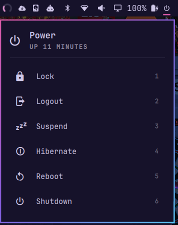

# Power Menu for Omarchy



A power button for the Omarchy bar. Click it to open a popup with:

| # | Action    | Command                   |
|---|-----------|---------------------------|
| 1 | Lock      | `omarchy-system-lock`     |
| 2 | Logout    | `omarchy-system-logout`   |
| 3 | Suspend   | `systemctl suspend`       |
| 4 | Hibernate | `systemctl hibernate`     |
| 5 | Reboot    | `omarchy-system-reboot`   |
| 6 | Shutdown  | `omarchy-system-shutdown` |

- **Suspend** is hidden when you've turned suspend off in Omarchy.
- **Hibernate** only shows when hibernation is set up (`omarchy-hibernation-available`).
- **Logout**, **Reboot** and **Shutdown** ask for confirmation first.
- Keyboard: arrows or `j`/`k` to move, `Enter` to select, `1`–`6` for a direct pick, `Esc` to close.

## Requirements

- Omarchy 4 (the Quickshell-based `omarchy-shell` bar)
- Nothing else to install: it uses the `omarchy-system-*` commands, `systemctl`
  and the Nerd Font icons that ship with Omarchy

## Install

```bash
omarchy plugin add https://github.com/alshareedah22/omarchy-power-menu.git --enable
```

The button is added at the far right edge of the bar. Move it anywhere with
`omarchy bar move`.

## Remove

```bash
omarchy plugin remove blackcode.power-menu
```

## Update

```bash
omarchy plugin update blackcode.power-menu
```

## Settings

To keep the button pinned at the far right edge, even when other widgets are
added later (it moves itself back there):

```bash
omarchy bar set blackcode.power-menu pinned true --json
```

To skip the confirmation for logout, reboot and shutdown, set `confirm` to
`false` on the widget in `~/.config/omarchy/shell.json`:

```bash
omarchy bar set blackcode.power-menu confirm false --json
```

## License

MIT
